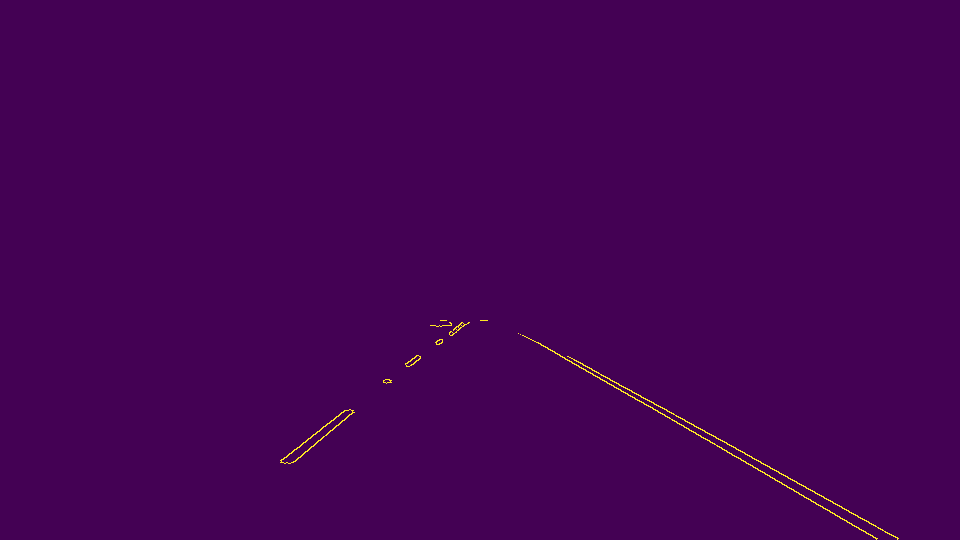
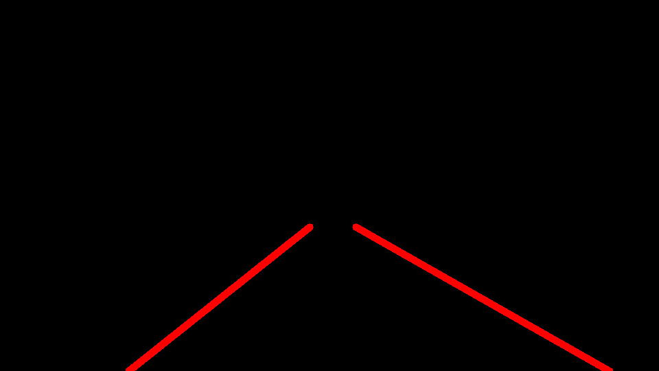
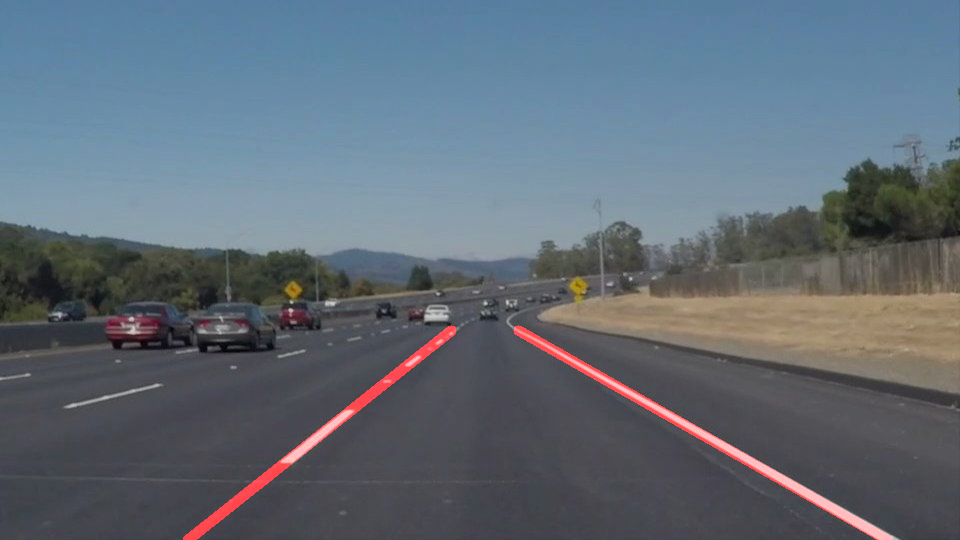

# **Finding Lane Lines on the Road** 

### Reflection

### 1. Describe your pipeline. As part of the description, explain how you modified the draw_lines() function.

My pipeline consisted of 7 steps. 

1. Imported the orginal image: Other images are saved in test_images folder

2. Gray scale the image - The image was copied and converted to gray scale by using : Other images are saved in test_images_gray folder
    cv2.cvtColor(img, cv2.COLOR_RGB2GRAY)

3. Gaussian Smoothing - The gray scale image was filtered by doing gaussian smoothing : Other images are saved in test_images_filter folder
    kernel size selected 5
    cv2.GaussianBlur(img, (kernel_size, kernel_size), 0)

4. Canny Edge Detection - Canny Edge detection was performed on the filtered image: Other images are saved in test_images_canny folder
    low_threshold selected 50
    high_threshold selected 150
    cv2.Canny(img, low_threshold, high_threshold)

5. Region of Interest - The canny edge detected image was then masked and cropped to only display required region of interest: Other images are saved in test_images_cropped folder

   5.1 The vertices were marked using a polygon -
   vertices = np.array([[(0,imshape[0]),(440,320),(490,320),(imshape[1],imshape[0])]],dtype = np.int32)
   
   5.2 The image was then masked -
   cv2.fillPoly(mask, vertices, ignore_mask_color)
   
   5.3 Finnaly a cropped image was obtained focusing only on ROI 
   

6. Hough Transform - Hough plan transformation was performed on the cropped image and then lanes were drawn in the image plan: Other images are saved in test_images_houghlines folder

    6.1 Hough transform -
    rho selected 1              
    theta selected np.pi/180    
    threshold selected  25        
    min_line_length selected 20  
    max_line_gap selected 5
    cv2.HoughLinesP(img, rho, theta, threshold, np.array([]), minLineLength=min_line_len, maxLineGap=max_line_gap)
    
    6.2 Drawing Lanes - The basic ideal here is the right lanes will have slope>0 and left lanes have slope<0. 
    color selected red [255, 0, 0]
    thickness selected 10
    cv2.line(img, (x1, y1), (x2, y2), color, thickness)

7. Final merged image - Finally the hough tranformed image was weighted and merged with a original image: Other images are saved in test_images_output folder

    cv2.addWeighted(initial_img, α, img, β, γ)

### 2. Identify potential shortcomings with your current pipeline

I have tried another method for implementing the draw lines function after doing the Hough Transform. This method uses calls other helpdraw function to determine the coordinates. Below is the code for same:

    ` def drawlinehelp(img, X, Y, color=[255, 0, 0], thickness=10):
        if len(X) == 0:
        return
    
        parameters = np.polyfit(X, Y, 1) 
    
        slope = parameters[0]
        intercept = parameters[1]
    
        y1 =  img.shape[0]
        x1 = int((y1 - intercept) / slope)
        y2 = int(y1 * (3 / 5))
        x2 = int((y2 - intercept) / slope)
        cv2.line(img, (x1, y1), (x2, y2), color, thickness)
        

    def draw_lines(img, lines, color=[255, 0, 0], thickness=10):
    """
    NOTE: this is the function you might want to use as a starting point once you want to 
    average/extrapolate the line segments you detect to map out the full
    extent of the lane (going from the result shown in raw-lines-example.mp4
    to that shown in P1_example.mp4).  
    
    Think about things like separating line segments by their 
    slope ((y2-y1)/(x2-x1)) to decide which segments are part of the left
    line vs. the right line.  Then, you can average the position of each of 
    the lines and extrapolate to the top and bottom of the lane.
    
    This function draws `lines` with `color` and `thickness`.    
    Lines are drawn on the image inplace (mutates the image).
    If you want to make the lines semi-transparent, think about combining
    this function with the weighted_img() function below
    """
        leftpointsX = []
        rightpointsX = []
        leftpointsY = []
        rightpointsY = []
    
        for line in lines:
            for x1,y1,x2,y2 in line:
                m = (y2-y1)/(x2-x1) # slope calculated to determine left and right lane
                if(m < 0):  # when slope is less than 0 belongs to left lane put the points in the left lane (done by append function)
                    leftpointsX.append(x1)
                    leftpointsX.append(x2)
                    leftpointsY.append(y1)
                    leftpointsY.append(y2)
                if(m > 0):  # when slope is greater than 0 belongs to right lane put the points in the right lane (done by append function)
                    rightpointsX.append(x1)
                    rightpointsX.append(x2)
                    rightpointsY.append(y1)
                    rightpointsY.append(y2)
    
            drawlinehelp(img, leftpointsX, leftpointsY, color=[255, 0, 0], thickness=10)
            drawlinehelp(img, rightpointsX, rightpointsY, color=[255, 0, 0], thickness=10) `

I ran the code with both the draw lines functions, 1. originally used in the code and 2. described above. Also, I tried running using various threshold, min_line_length and max_line_gap values. Also, commented other possible values in the code. 
Common obeservation were
1. the lane lines were running good on straight road and fair on the curve roads. 
2. The lane lines are little shaky. 

### 3. Suggest possible improvements to your pipeline

New technique SCNN could help giving more robust output. Spatial CNN (SCNN) proposes an architecture which “generalizes traditional deep layer-by-layer convolutions to slice-by slice convolutions within feature maps”.
